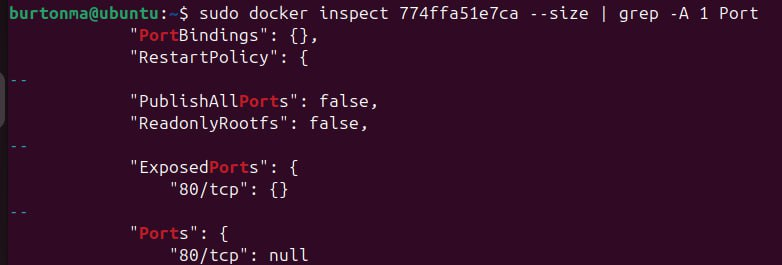
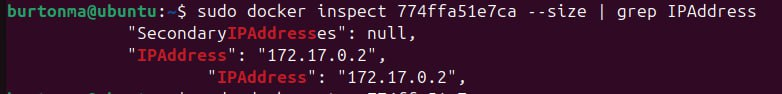
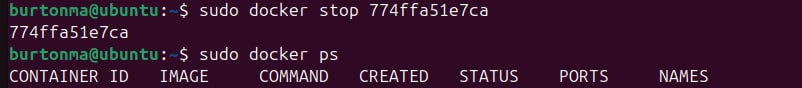
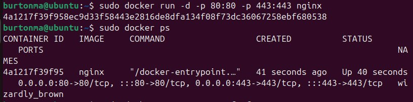
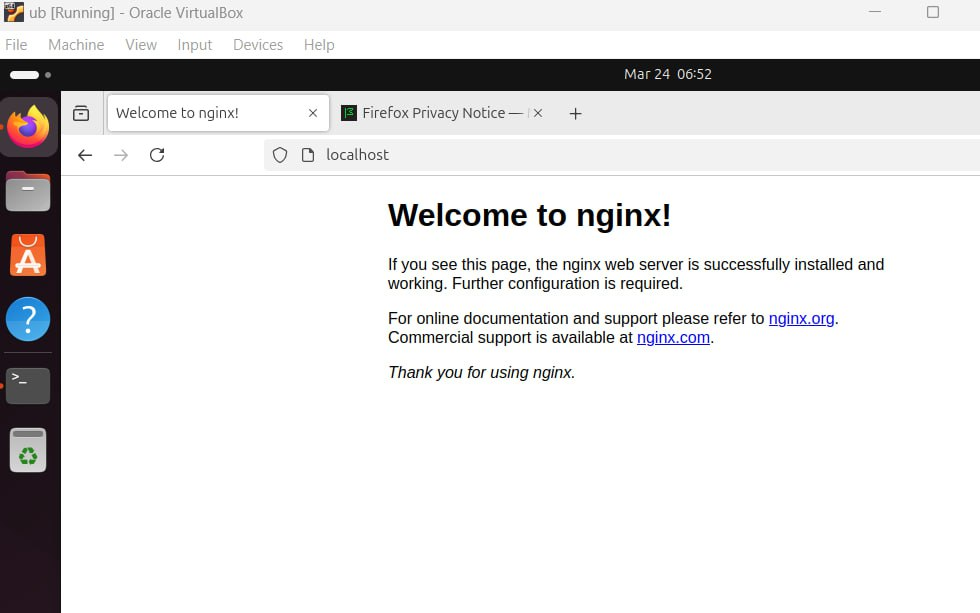
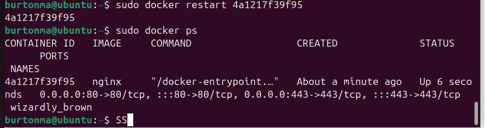

## Part 1. Готовый докер

**Скачивание образ nginx при помощи `sudo docker pull nginx`**

**Проверка командой `sudo docker images`**

**Запуск докер-образ nginx через `sudo docker run -d [image id]`**

**Проверка, что образ запустился командой `sudo docker ps`**

**Просмотр информации о контейнере с помощью команды `sudo docker inspect [container id]`**

**Определение размера контейнера с помощью команды `sudo docker inspect [container id] --size | grep Size`**

**Определение списка замапленных портов с помощью команды `sudo docker inspect [container id] --size | grep -A 1 Port`**

**Определение ip контейнера с помощью команды `sudo docker inspect [container id] --size | grep IPAddress`**

+ размер контейнера 192005337
+ список замапленных портов "80/tcp":null
+ ip контейнера "127.17.0.2"

**Остановка контейнера командой `sudo docker stop [container id]` и проверка остановился ли контейнер командой`sudo docker stop ps`**

**Запуск контейнера с портами 80 и 443 в контейнере, замапленными на такие же порты на локальной машине командой`sudo docker run -d -p 80:80 -p 443:443 nginx` и проверка запущенных контейнеров `sudo docker ps`**

**Проверка, что в браузере по адресу localhost:80 доступна стартовая страница nginx**

**Перезапуск докер контейнера командой `sudo docker restart [container id]` и проверка что он запустился  командой `sudo docker ps`**

## Part 2. Операции с контейнером

**Чтобы прочитать конфигурационный файл nginx.conf внутри Docker контейнера через команду exec, использовала `sudo docker exec [container id] cat /etc/nginx/nginx.conf`**

**Создание на локальной машине файл nginx.conf и настраиваем в нем отдачу страницы статуса сервера nginx по пути /status
Просмотр содержимого с помощью `cat nginx.conf`**

**Скопировала созданный файл nginx.conf внутрь докер-образа через команду `docker cp nginx.conf [container id]:/etc/nginx` и проверила,  что файл скопировался командой `sudo docker exec [container id] cat /etc/nginx/nginx.conf`**

**Перезапуск nginx внутри докер-образа через команду `sudo docker exec [container id] nginx -s reload`**

**Проверка, что по адресу localhost:80/status выдается страничка со статусом сервера nginx**

**Экспорт контейнера в архив container.tar командой `sudo docker export [container id] > container.tar`**

**Удаление образа через`docker rmi -f nginx`**

**Импорт контейнера обратно командой `docker import -c 'cmd ["nginx", "-g", "daemon off;"]' ./container.tar nginx:import`**

**Запуск импортированного контейнера через `sudo docker run -d -p 80:80 -p 443:443 nginx` и  проверка запуска `sudo docker ps`**

**Проверка, что по адресу localhost:80/status отдается страничка со статусом сервера nginx**

## Part 3. Мини веб-сервер

**Изменила nginx.conf, который будет проксировать все запросы с 81 порта на 127.0.0.1:8080**

**Проверяю и запускаю конфигруационный файл nginx.conf командами `nginx -t -c $(pwd)/nginx.conf` и `nginx -c $(pwd)/nginx.conf`**

**Запуск FastCGI-сервера в фоновом режиме на порту 8080 командой `spawn-fcgi -p 8080 ./server`**

**Написала мини сервер на C и FastCgi, который будет возвращать простейшую страничку с надписью Hello World!:**

**Проверка, что в браузере по localhost:81 отдается написанная страничка с hello world**

## Part 4. Свой докер
**Собрала написанный докер образ через docker build при этом указав имя и тег`docker build -t part4:v1 .`**

**Проверка через docker images, что все собралось корректно командой`sudo docker images`**

**Запустила собранный докер-образ с маппингом 81 порта на 80 на локальной машине и маппингом папки ./nginx внутрь контейнера по адресу, где лежат конфигурационные файлы nginx'а командой `sudo docker run -it -p 80:81 -v "$(pwd)/nginx.conf:/etc/nginx/nginx.conf [image id] bash`  и  проверка, что по localhost:80 доступна страничка написанного мини сервера с помощью утилиты `curl`**

**Изменение раздела server в файле nginx.conf**

**Перезапуск контейнера командой `docker restart [container id]` и проверка, что по localhost:80/status доступна страничка написанного мини сервера с помощью утилиты `curl`**

## Part 5. Dockle

**Установка Dockle:**

**Сканирование образа из предыдущего задания через `sudo dockle -ak NGINX_GRGKEY -ak NGINX_GRGKEY_PATH -ak NGINX_GRGKEYS part4:v1`**

**Заново собираю исправленный образ  с помощью команды `sudo docker build -t burtonma:part5` и проверяю командой `sudo docker images`**

**Проверка, что при проверке dockle исправленного образа нет ошибок и предупреждений через `sudo dockle burtonma:part5`**

## Part6. Базовый Docker Compose

**файл docker-compose.yml**

**Подняла командами `sudo docker-compose up -d part6` и `sudo docker-compose up -d proxy`**

**Остановка всех запущенных контейнеров командой `sudo docker-compose down`**

**Собрала и запустила проект с командой `sudo docker-compose up --build -d`**

**Проверка, что в браузере по localhost:80 отдается написанная страничка, как и ранее с помощью команд `curl http://localhost:80` и `curl http://localhost:80/status`**

